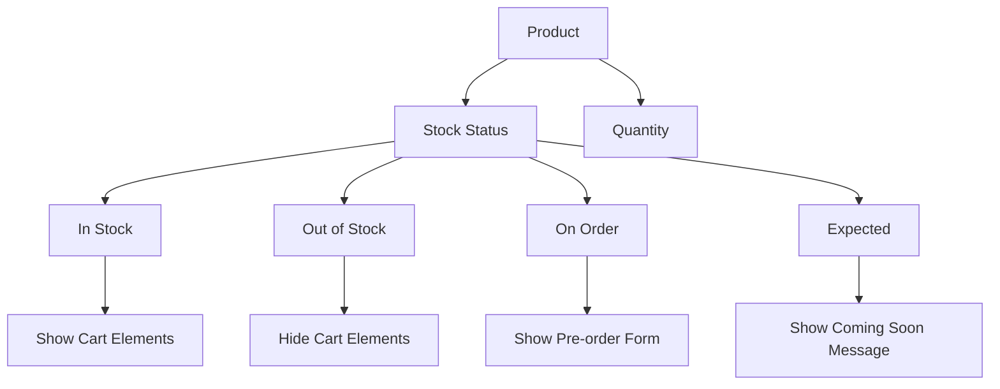

# Stock Status System Overview

The Stock Status System is a powerful feature introduced in F-Shop v1.5.0 that provides flexible product availability management.

## What's New

Traditional stock management based solely on quantity has been enhanced with a comprehensive status system that gives you more granular control over how products are displayed and handled in your store.

## Core Concepts

### Stock Status vs Quantity

While traditional systems rely only on numeric quantities, the new system combines:

- **Status-based logic** - Descriptive availability states
- **Quantity tracking** - Numerical inventory management
- **Behavior control** - UI and functionality rules

### Benefits

- More descriptive product states
- Better customer communication
- Flexible business logic
- Easy extensibility
- Backward compatibility

## System Architecture

## How It Works

The system works by:

1. **Setting Status** - Administrators assign stock statuses to products
2. **Checking Availability** - Functions determine product availability
3. **Controlling Display** - UI elements are shown/hidden based on status
4. **Processing Orders** - Business logic handles different status scenarios

## Integration Points

The stock status system integrates with:

- Product listing pages
- Single product pages
- Shopping cart functionality
- Checkout process
- Admin product management
- Third-party extensions

## Migration Path

Existing installations will automatically use the new system while maintaining full backward compatibility with existing quantity-based logic.